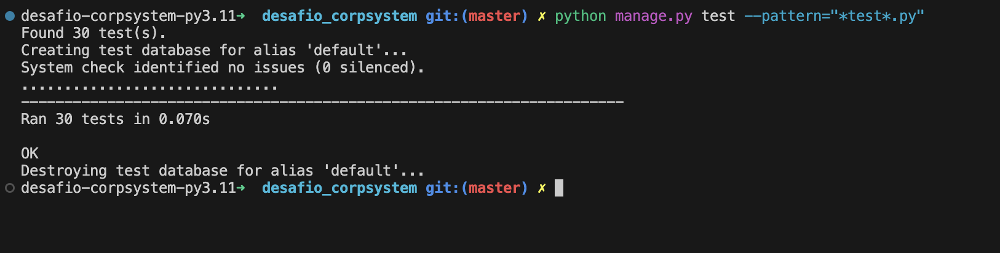
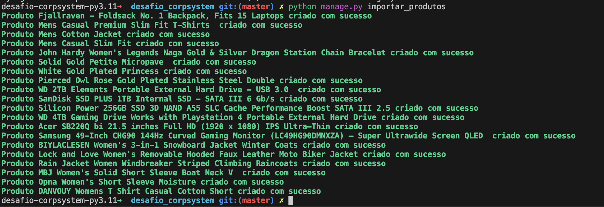
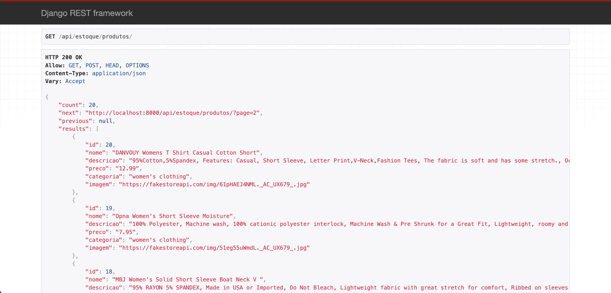
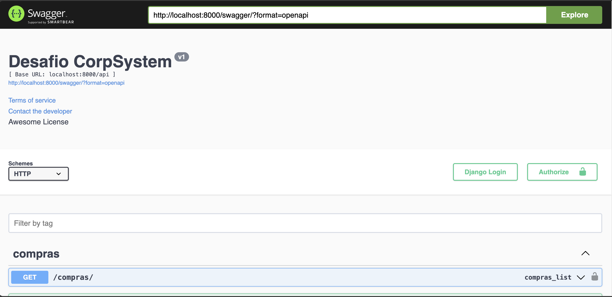
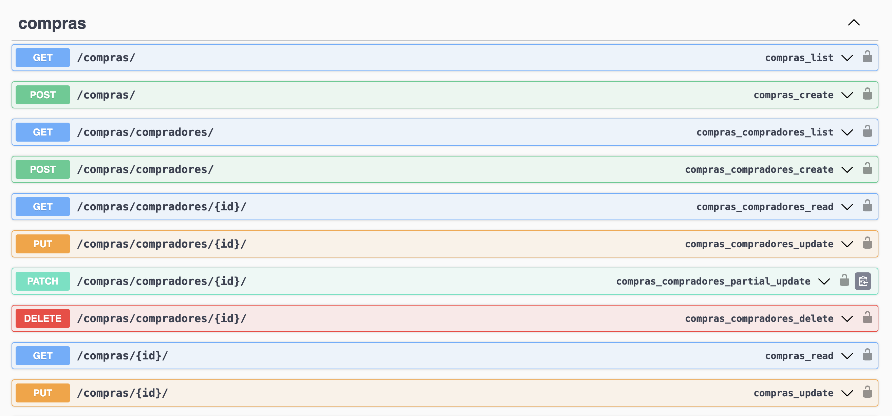
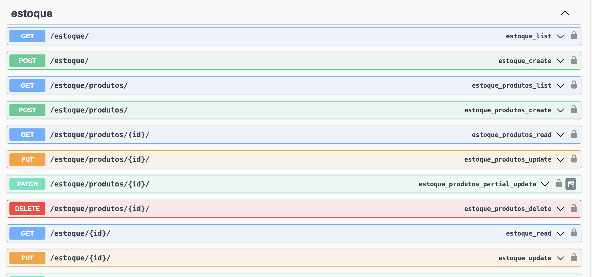
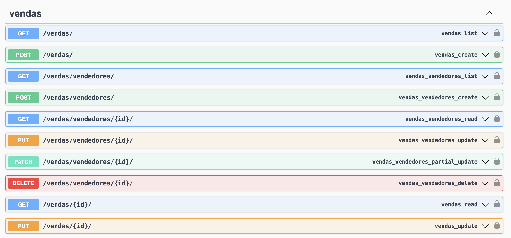

# Desafio CorpSystem

## Desenvolver uma API Rest de controle de estoque com os seguintes módulos:
- Venda
- Vendedor
- Compra
- Comprador
- Estoque

## Link para aplicação no ar
    Deploy realizado utilizando Dokku instalada na AWS
[https://corp.brunoxbk.online/](https://corp.brunoxbk.online/)

## Stack utilizada:

- [Docker](https://www.docker.com/)
- [Python](https://www.python.org/)
- [Django](https://www.djangoproject.com/)
- [MySQL](https://www.mysql.com/)
- [Django REST Framework](https://www.django-rest-framework.org/)
- [Dokku](https://dokku.com/)
- [AWS](https://aws.amazon.com/pt/console/)

## Variáveis de ambiente

    DEBUG=True
    SECRET_KEY=arandomstring
    ALLOWED_HOSTS=*,
    DATABASE_URL=
    DB_NAME=
    DB_USER=
    DB_PASSWORD=
    DB_HOST=db
    DB_PORT=3306
    RUN_PORT=8000
    RUN_HOST=0.0.0.0

## Instalação via Poetry

1. Duplicar o arquivo de variáveis de ambiente e renomealo para .env e configurar as variáveis locais
    ```sh
    cp .env.sample .env 
    ```

2. Instalar os requisitos
    ```sh
    poetry install
    ```

3. Rodar as migrações para criar as tabelas no banco de dados
    ```sh
    poetry run python manage.py migrate
    ```

4. Subir o servidor local
    ```sh
    poetry run python manage.py runserver
    ```

## Instalação via Docker

1. Fazer o build das imagens
    ```sh
    docker compose build
    ```

2. Subir os containers
    ```sh
    docker compose up
    ```

## Testes
- Rodar testes com Poetry
    ```sh
    poetry run python manage.py test --pattern="*test*.py"
    ```
- Rodar testes com Docker
    ```sh
    docker compose exec web poetry run python manage.py test --pattern="*test*.py"
    ```

## Importação de Produtos
- Importar produtos com Poetry
    ```sh
    poetry run python manage.py importar_produtos     
    ```

- Importar produtos com Docker
    ```sh
    docker compose exec web poetry run python manage.py importar_produtos     
    ```

# Evidências e testes

    Testes unitários



    Importação



    Django Rest Framework



    Swagger







## Swagger do projeto

- [Swagger](https://corp.brunoxbk.onlineswagger/)


## DRF endpoints

- [Venda](https://corp.brunoxbk.online/api/vendas/)
- [Vendedor](https://corp.brunoxbk.online/api/vendas/vendedores/)
- [Compra](https://corp.brunoxbk.online/api/compras/)
- [Comprador](https://corp.brunoxbk.online/api/compras/compradores/)
- [Estoque](https://corp.brunoxbk.online/api/estoque/)
- [Produtos](https://corp.brunoxbk.online/api/estoque/produtos/)